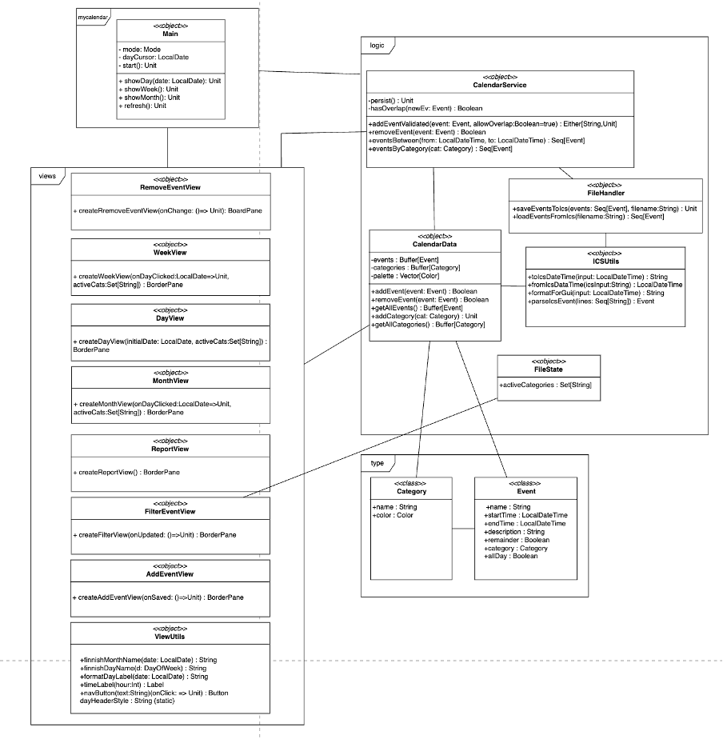
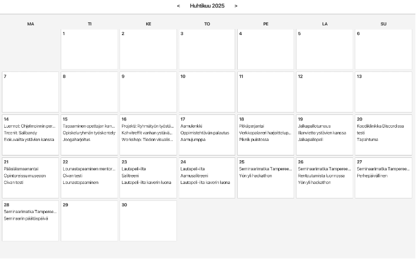
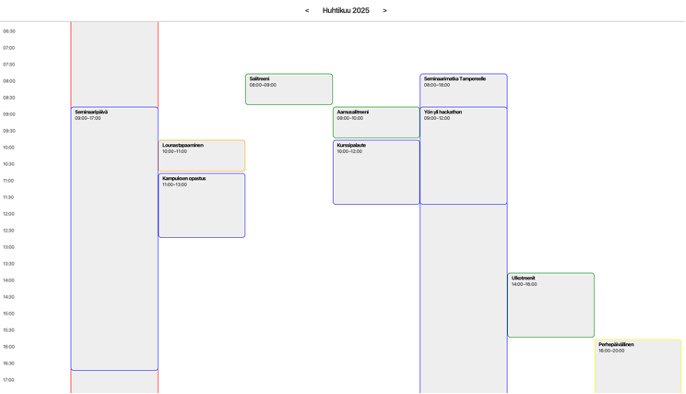
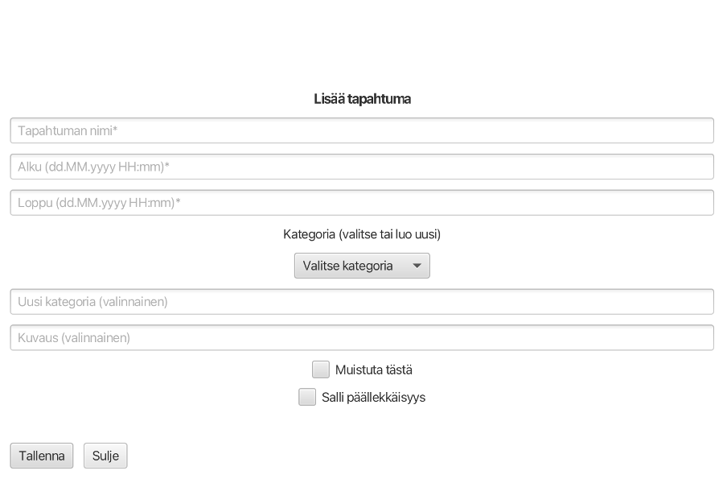

# Kalenterisovellus — ScalaFX Desktop Calendar

[](#)
[](#)
[](#)

A clean, local-first **desktop calendar** built with **ScalaFX**. It provides **Day / Week / Month** views, adding and removing events with validation, **category-based filtering**, and a simple **reporting** view that summarizes counts and total hours per category. Data is stored in a portable **iCalendar (.ics)** file for easy interchange.

---

## Highlights

- **Three time views**: Day (15-minute slots), Week (30-minute slots), Month (compact tiles).
- **Add & remove events** with input validation (end must be after start; optional overlap allowance).
- **Category filters** that instantly update all views; categories also define event color accents.
- **Reports** view: counts and total hours per category for current week, current month, or all events.
- **Local-first & offline**: no network calls; events persisted to a single `.ics` file.
- **Straightforward architecture** separated into `types`, `logic`, and `views`.

---

## Architecture

<p align="center">
  
</p>

- **Entry & navigation:** main app sets up the top bar and routes between views.
- **Types:** minimal domain models (`Event`, `Category`).
- **Logic:** in-memory store, validations, and iCalendar read/write.
- **Views:** Day/Week/Month grids, Add/Remove forms, Filter and Report utilities.

---

## Screenshots

<p align="center">
  <br>
  <em>Month view (compact calendar grid)</em>
</p>

<p align="center">
  <br>
  <em>Week view (30-minute time slots, colored by category)</em>
</p>

<p align="center">
  <br>
  <em>Add event form with validation, optional reminder & overlap flag</em>
</p>

---

## Getting Started

### Prerequisites
- Java 11+
- [sbt](https://www.scala-sbt.org/)
- macOS, Linux, or Windows

### Run locally
```bash
sbt run
